# Nightingale — Mobile App User Flow

> **What this doc is:** a step-by-step walkthrough of how a field worker (nurse,
> technician, or driver) actually moves through the mobile app during a shift — not just
> what each screen contains (see [Frontend & Mobile Features.md](Frontend%20%26%20Mobile%20Features.md)
> for that), but the order things happen in, and what the worker sees at each step.
>

---

## Table of Contents

1. [Who This Is For](#1-who-this-is-for)
2. [Flow A: Sign In](#2-flow-a-sign-in)
3. [Flow B: Starting a Shift](#3-flow-b-starting-a-shift)
4. [Flow C: Working a Job](#4-flow-c-working-a-job)
5. [Flow D: Going Unavailable](#5-flow-d-going-unavailable)
6. [Flow E: Ending a Shift & Signing Out](#6-flow-e-ending-a-shift--signing-out)
7. [Putting It All Together (A Full Shift)](#7-putting-it-all-together-a-full-shift)
8. [What's Not in the App Yet](#8-whats-not-in-the-app-yet)

---

## 1. Who This Is For

The mobile app is used by **nurses, technicians, and drivers** — the people actually out
doing the work. It's a small, focused app: see your jobs, do your jobs, tell the office
where you are. This doc walks through it the way a field worker would actually use it
during a real shift.

---

## 2. Flow A: Sign In

```
 [Login screen]  →  enter username + password  →  Home (orders list)
```

1. Open the app — if not signed in, the **Login** screen appears.
2. Enter your username and password (a separate account from the web console's — this is
   your own field-worker login).
3. On success, you land on the **Home** screen with today's assigned jobs.

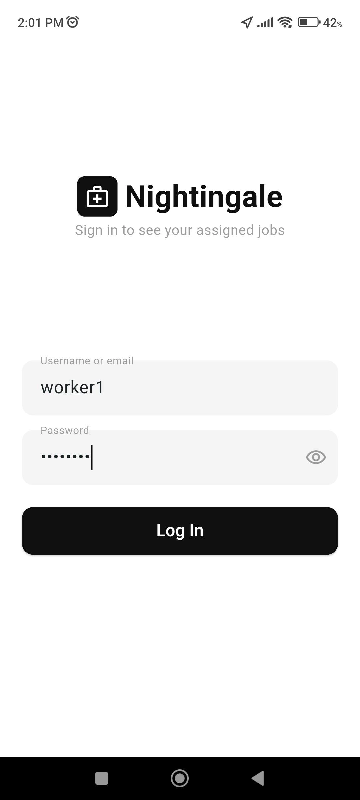

---

## 3. Flow B: Starting a Shift

Before heading out, a worker starts their shift so the office can see where they are.

```
 Home screen
   │
   └─ tap "Start Shift" ──► phone begins sending live GPS pings to the server
                              (this is what makes the worker's dot appear on the
                               web console's Live Tracking map)
```

1. From the **Home** screen, tap **Start Shift**.
2. The app begins streaming the phone's location to the server in the background. There's
   no separate "attendance" step — starting a shift *is* turning on live location sharing.
3. From this point on, a dispatcher watching the web console's **Live Tracking** page can
   see this worker moving on the map in real time.

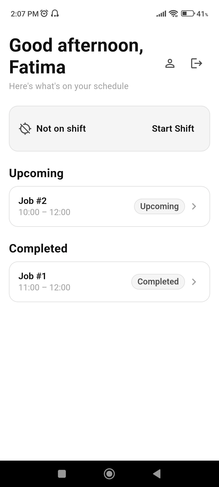
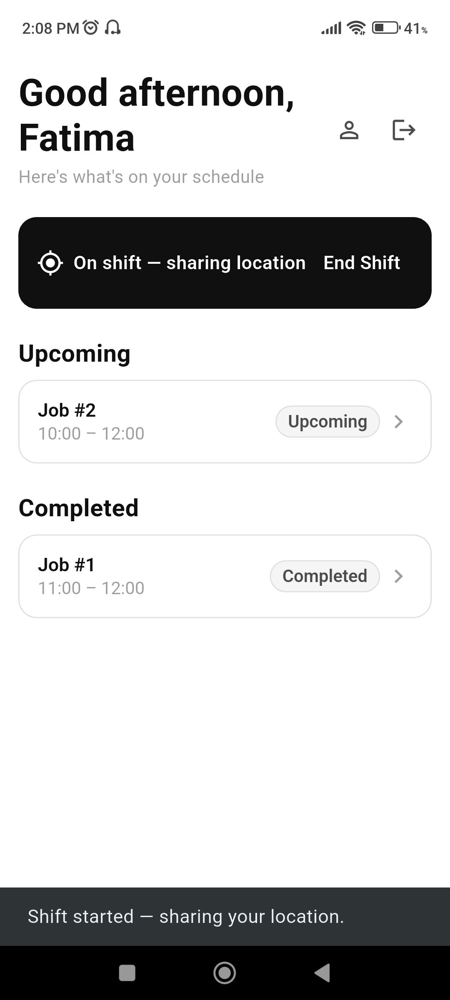

---

## 4. Flow C: Working a Job

The main loop of the day: open a job, see where it is, go do it, mark it done.

```
 Home (orders list)
   │
   └─ tap an order ──► Order Details
                          │
                          ├─ tap "View Route" ──► map: depot → this order's location
                          │
                          └─ tap "Complete" ──► job marked done, back to Home
```

1. On the **Home** screen, tap any order in the list to open its **Order Details**.
2. The details screen shows the specifics of the job — what it is, where it is, and so on.
3. Tap **View Route** to see a map of the route from the depot to this order's location, so
   the worker knows where they're headed and how to get there.
4. Once the job is actually done, tap **Complete** (this is on a different screen than the
   route map — the worker navigates back to the order details to mark it complete).
5. The app returns to the **Home** screen, and the completed job is no longer pending.
6. Repeat for each job in the day's list.


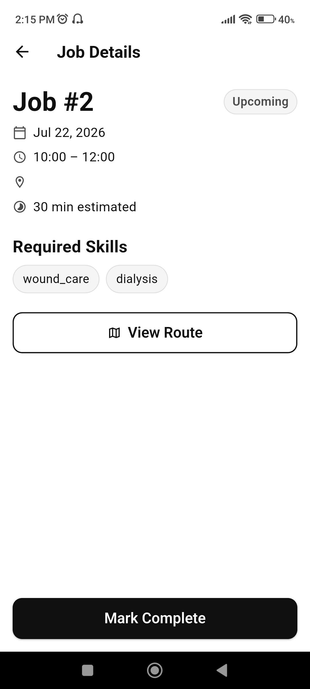
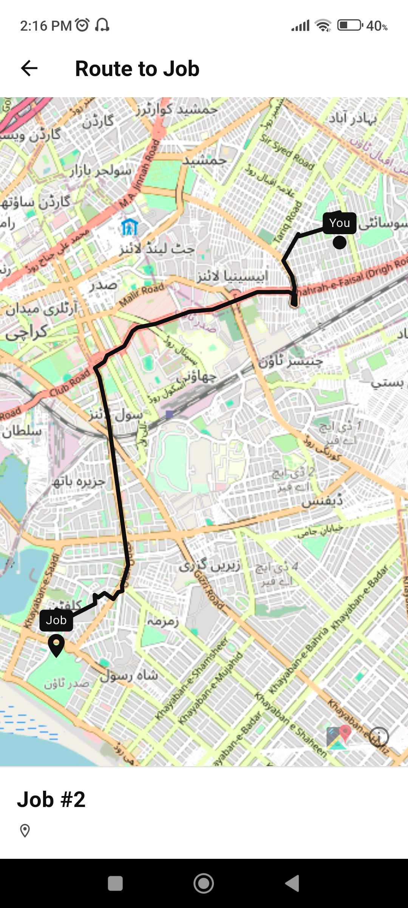
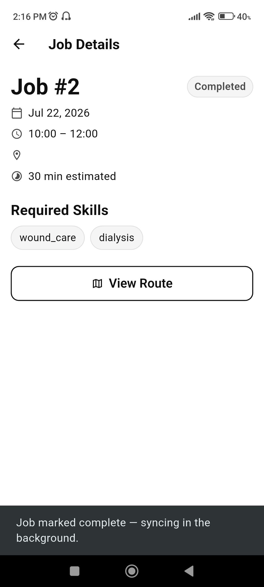
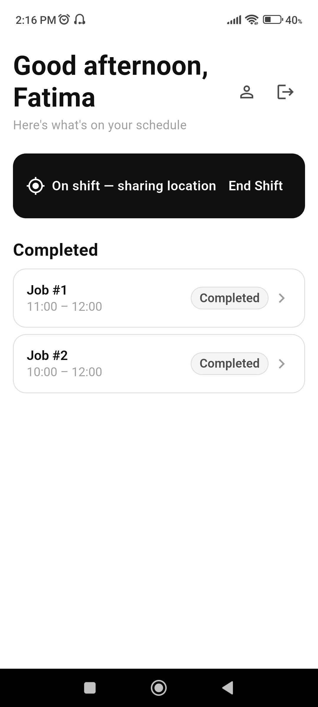

---

## 5. Flow D: Going Unavailable

If a worker needs to step away or can't take more work, they can toggle their own
availability — this immediately reflects on the dispatcher's roster on the web console.

```
 Home screen
   │
   └─ tap person icon ──► Availability screen
                             │
                             └─ toggle to "Unavailable"
                                   │
                                   ├─ (optional) type a reason
                                   └─ tap "Confirm" ──► status updated
```

1. From **Home**, tap the **person icon**.
2. On the Availability screen, toggle from Available to Unavailable (or back).
3. If going unavailable, the app asks for a short reason. In the current version, this can
   be left blank — typing something is optional, not required.
4. Tap **Confirm**. The change is immediate and shows up right away on the dispatcher's
   availability roster on the web console (see the web flow doc, Flow E).

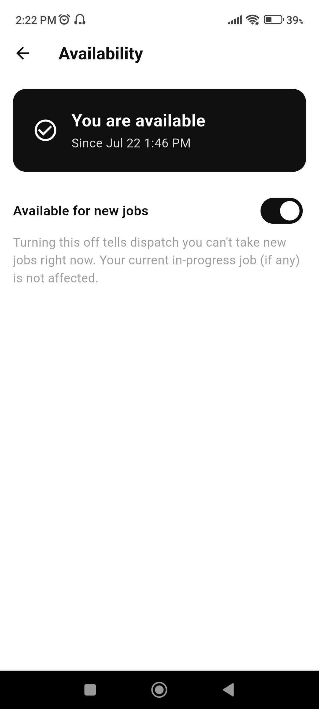
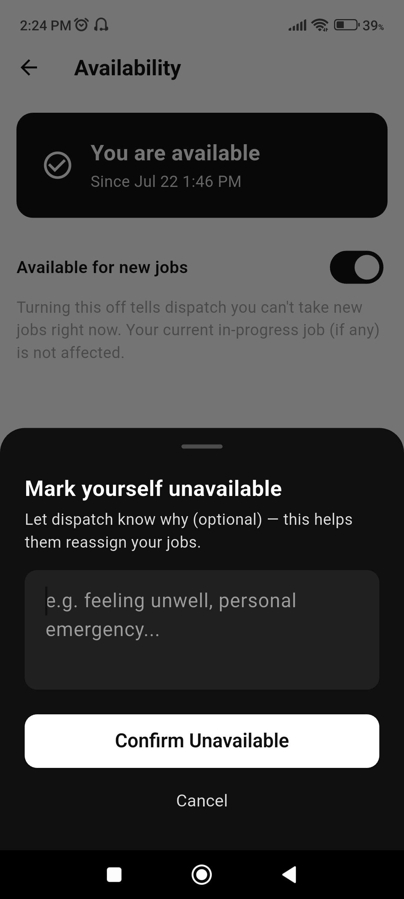
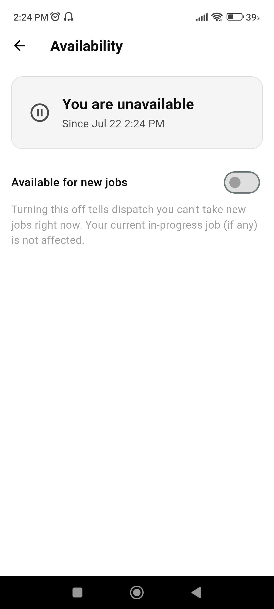

---

## 6. Flow E: Ending a Shift & Signing Out

```
 Home screen
   │
   ├─ tap "End Shift" ──► phone stops sending GPS pings
   │
   └─ tap exit/logout icon ──► signed out, back to Login
```

1. At the end of the work day, tap **End Shift** on the Home screen. This stops the phone
   from sending location updates — the worker's dot disappears from the dispatcher's Live
   Tracking map.
2. Tap the **exit icon** to log out of the app entirely, returning to the Login screen.


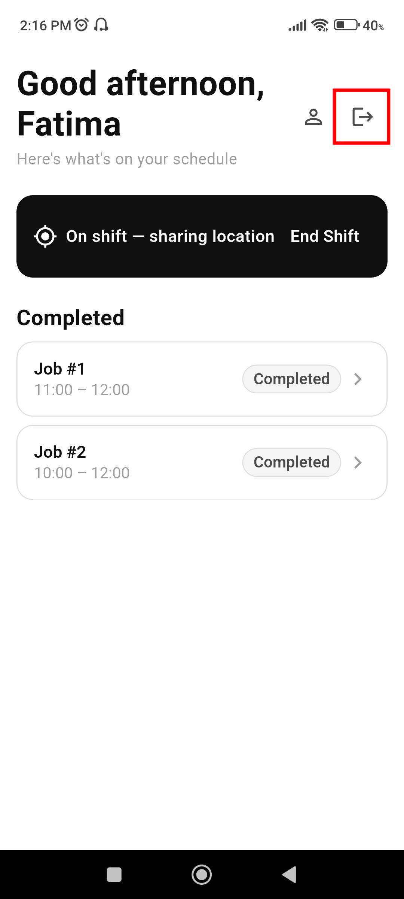

---

## 7. Putting It All Together (A Full Shift)

```
1. Sign in                                        (Flow A)
2. Tap "Start Shift" to begin sharing location      (Flow B)
3. Work through the day's jobs one by one:          (Flow C)
     open order → View Route → travel → Complete
4. If needed, toggle unavailable partway through    (Flow D)
5. Tap "End Shift" when the day's work is done       (Flow E)
6. Log out                                          (Flow E)
```

---

## 8. What's Not in the App Yet

A couple of things worth knowing about the current version, so expectations are set
correctly:

- **Only one completion state.** The system behind the scenes can track more granular job
  progress (e.g. "on my way," "arrived," "in progress") before marking something fully
  complete, but the app today only exposes the final **Complete** action — there's no
  in-between status a worker can set.
- **"Start/End Shift" is just location sharing**, not a formal attendance or clock-in/out
  record — there's no timesheet or attendance history behind it yet.

*(These are tracked as future improvements — see
[Future Improvements & Concerns.md](Future%20Improvements%20%26%20Concerns.md).)*

---

*This is a companion to [Frontend & Mobile Features.md](Frontend%20%26%20Mobile%20Features.md),
which explains what each screen contains. This doc focuses on the order things happen in
during a real shift. Screenshot placeholders throughout are ready for real captures.*
