# Nightingale — Web Console User Flow

> **What this doc is:** a step-by-step walkthrough of how a dispatcher or admin actually
> moves through the web console during a normal day — not just what each page contains
> (see [Frontend & Mobile Features.md](Frontend%20%26%20Mobile%20Features.md) for that), but
> the *order* they'd click through things in, and what happens on screen at each step.
>


---

## Table of Contents

1. [Who This Is For](#1-who-this-is-for)
2. [The Sidebar — Getting Around](#2-the-sidebar--getting-around)
3. [Flow A: Sign In](#3-flow-a-sign-in)
4. [Flow B: Morning Check-In (Dashboard)](#4-flow-b-morning-check-in-dashboard)
5. [Flow C: Add a New Order](#5-flow-c-add-a-new-order)
6. [Flow D: Build & Dispatch a Route Plan](#6-flow-d-build--dispatch-a-route-plan)
7. [Flow E: Watch the Field Live (Tracking)](#7-flow-e-watch-the-field-live-tracking)
8. [Flow F: Look Up Fleet or Worker Info](#8-flow-f-look-up-fleet-or-worker-info)
9. [Putting It All Together (A Full Day)](#9-putting-it-all-together-a-full-day)

---

## 1. Who This Is For

The web console is used by **dispatchers and admins** sitting at a desk, coordinating the
day's field work. This doc walks through the console the way one of them would actually use
it — start to finish, one flow at a time.

---

## 2. The Sidebar — Getting Around

Every page (other than Login) shares the same frame: a sidebar on the left for navigation,
and a header up top showing the current page's title and a live clock.

```
┌───────────────┬──────────────────────────────────────────────┐
│               │  Page Title              [search]   12:41 PM │
│  Dashboard    ├──────────────────────────────────────────────┤
│  Orders       │                                              │
│  Route Plans  │                                              │
│  Live Tracking│              (page content)                  │
│  Fleet        │                                              │
│  Workers      │                                              │
│               │                                              │
└───────────────┴──────────────────────────────────────────────┘
```

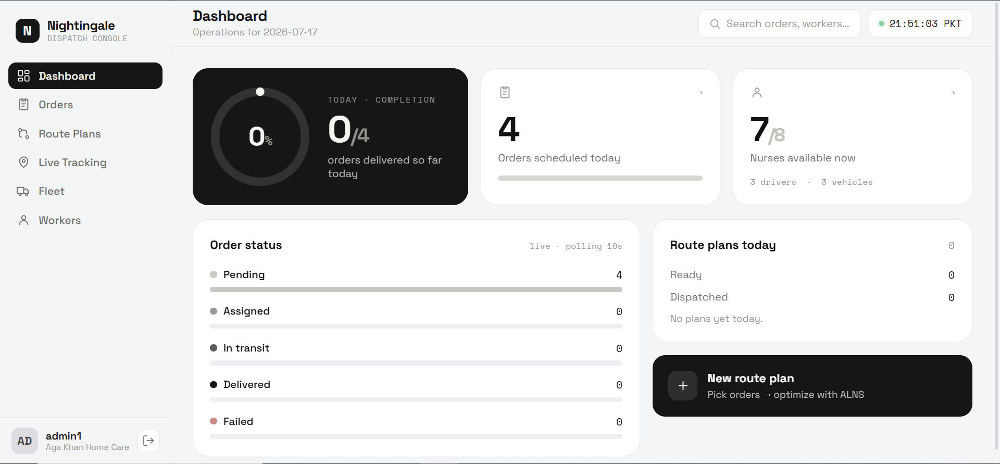

The sidebar order is intentional — it roughly mirrors the order a dispatcher touches things
during a day: check the Dashboard, manage Orders, build Route Plans, keep an eye on Live
Tracking, and check Fleet/Workers as reference.

---

## 3. Flow A: Sign In

```
 [Login screen]  →  enter username + password  →  Dashboard
```

1. Open the app — if not signed in, you land on the **Login** screen.
2. Enter your username and password, submit.
3. On success, you're dropped straight onto the **Dashboard**.
4. On failure (wrong credentials), an inline error message appears and you stay on the
   login screen to try again.

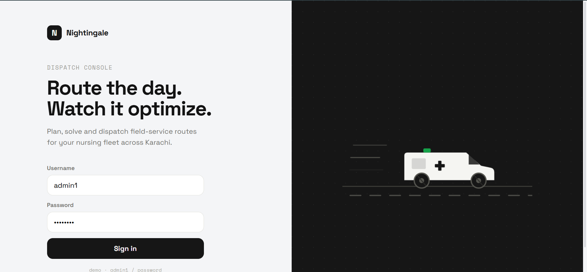

---

## 4. Flow B: Morning Check-In (Dashboard)

The Dashboard is usually the first stop of the day — a quick read on where things stand
before doing anything else.

```
 Dashboard
   │
   ├─ glance at: delivered / scheduled / available workers / order & plan statuses
   │
   ├─ click an Orders stat card ─────────► jumps to Orders page
   ├─ click a Workers stat card ─────────► jumps to Workers page
   └─ click "New route plan" ────────────► jumps to the new-plan picker (Flow D)
```

1. Land on the Dashboard after login (or by clicking **Dashboard** in the sidebar anytime).
2. Read the top-line numbers: how many orders are done today, how many are scheduled, how
   many workers are available right now.
3. Scan the order-status breakdown (pending/assigned/in transit/delivered/failed) and the
   route-plan status breakdown (draft/optimizing/ready/dispatched/completed) for anything
   that needs attention.
4. From here, a dispatcher typically does one of two things next: jump into **Orders** to
   add something new, or jump into **Route Plans** to build today's routes.


---

## 5. Flow C: Add a New Order

This is the **only place in the console where something new gets typed in by hand** — every
other page is for viewing existing data.

```
 Orders page
   │
   ├─ view list, filter by status chip (All / Pending / Assigned / …)
   │
   └─ click "New order" ──► fill out the order form ──► submit ──► order appears in the list
```

1. Click **Orders** in the sidebar.
2. The page shows every order that exists, with filter chips across the top to narrow the
   list by status.
3. Click **New order** to open the order form.
4. Fill in the details: which customer, where the service happens, what skills are needed
   (nurse or technician, depending on the company), what day/time window it should happen
   in, and how long it'll take.
5. Submit — the new order appears in the list with status **pending**, and is now eligible
   to be picked up by a route plan for its scheduled day.
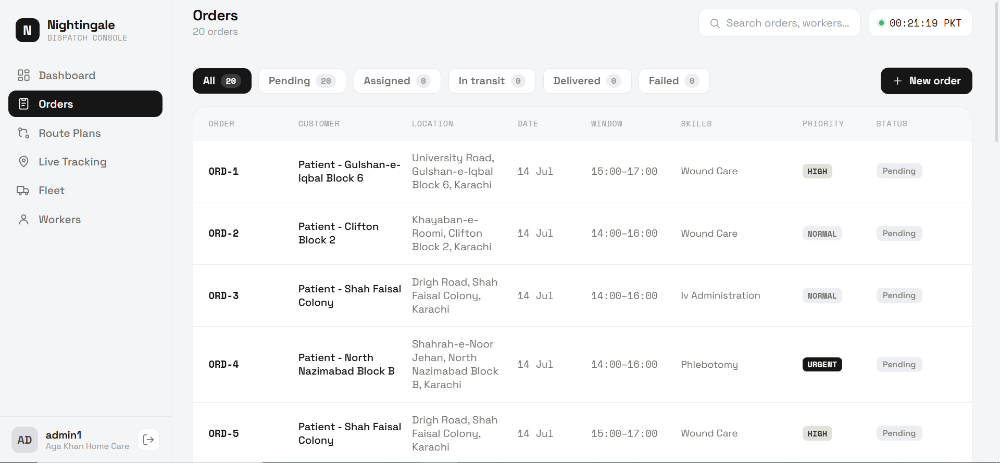
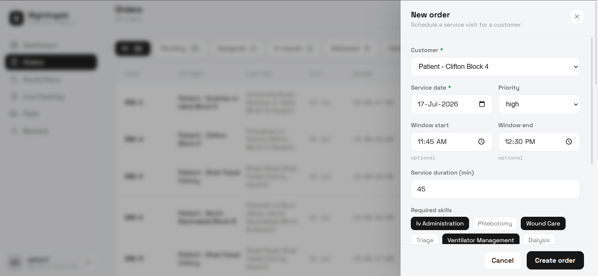
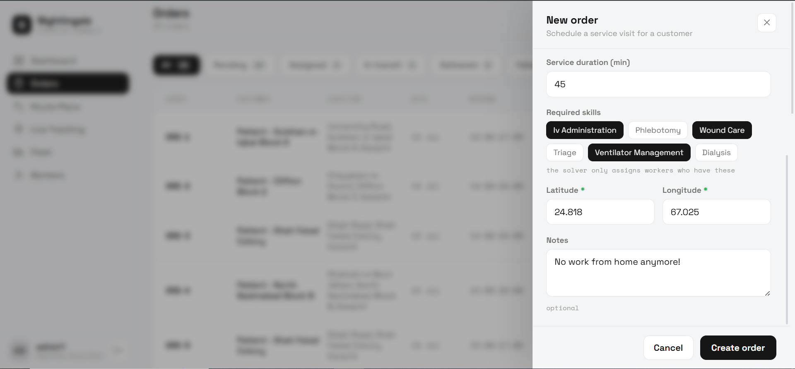

---

## 6. Flow D: Build & Dispatch a Route Plan

This is the core workflow of the whole system — turning a set of pending orders into an
actual, optimized plan, and sending it out to the field. It has several steps, each its own
screen.

```
 Route Plans (list)
   │
   ├─ click "New route plan"
   ▼
 New plan picker
   │  pick orders (all from ONE day) ──► click "Optimize"
   ▼
 Live solving view
   │  watch the optimizer work in real time (progress + a live-improving chart)
   │  waits here until the solve finishes
   ▼
 Plan detail (the result)
   │  map of every driver's route + who's doing what + any unfitted orders
   │
   ├─ optionally open "Diagnostics" for the full report card
   │
   └─ click "Approve" ──► plan is locked in and sent to workers' phones
```

1. Click **Route Plans** in the sidebar (or the Dashboard's **New route plan** shortcut).
2. The **plans list** shows every plan ever created — date, status, and a quick summary.
   Click **New route plan** to start one.
3. On the **picker** screen, select which orders to include. They must all share the same
   scheduled day — the picker will nudge you if you try to mix dates. Click **Optimize**.
4. You're taken to the **live solving view**. This shows the optimization engine (ALNS)
   working in real time: a stage tracker (loading → optimizing → saving → done) and a chart
   of the solution's quality improving as it searches. This typically takes well under a
   minute. You can simply wait here for it to finish.
5. Once done, you land on the **plan detail** page — the actual result:
   - A map with every driver's route drawn out, color-coded, with a legend you can click to
     highlight one driver's path.
   - Which worker is doing which job, in what order.
   - A callout if any orders couldn't be scheduled, so nothing silently falls through the
     cracks.
6. Optionally, expand **Diagnostics** — a report card on how the optimizer performed (how
   long it took, how much better the plan got, a cost breakdown, which strategies it used
   most). Useful if you're curious *why* the plan came out the way it did; not something you
   need to check every time.
7. When the plan looks good, click **Approve**. This locks the plan in, marks its orders as
   assigned, and sends a job notification to each assigned worker's phone — this is the
   moment the plan actually reaches the field (see the mobile flow doc for what happens
   next on their end).

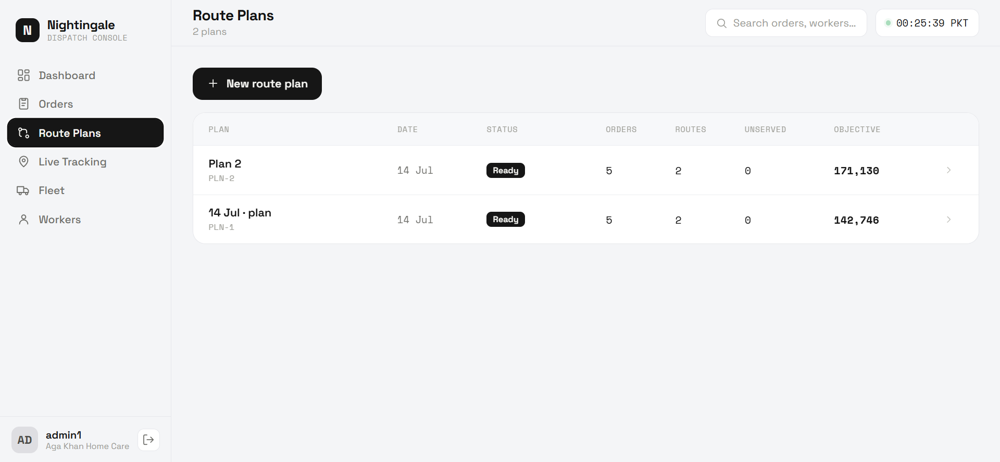
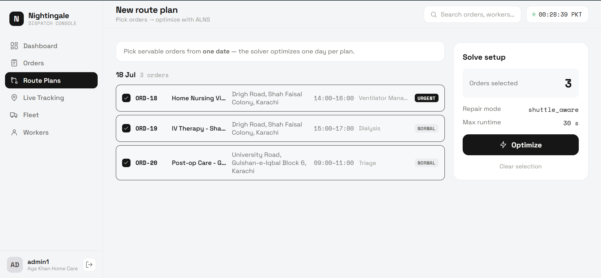
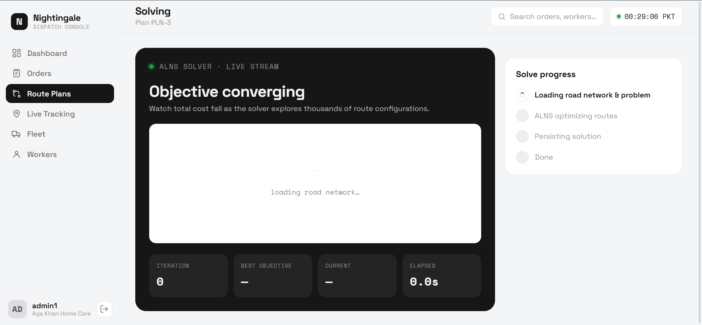
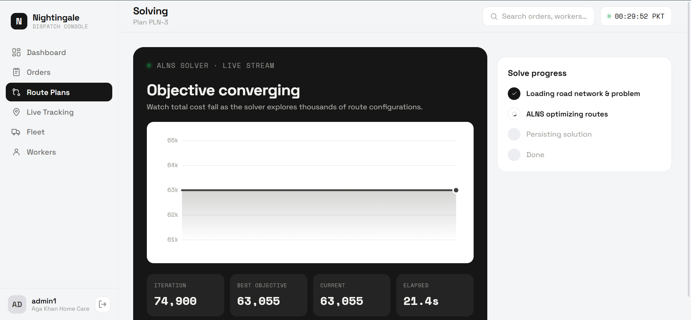
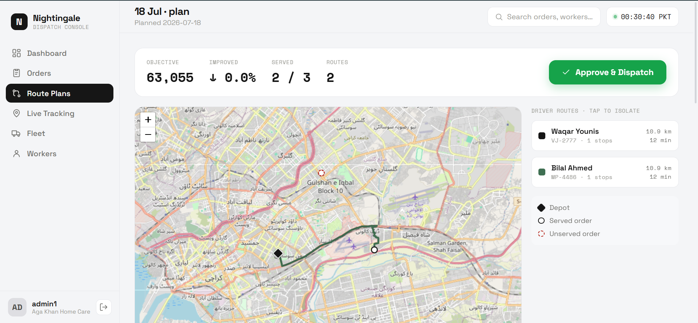
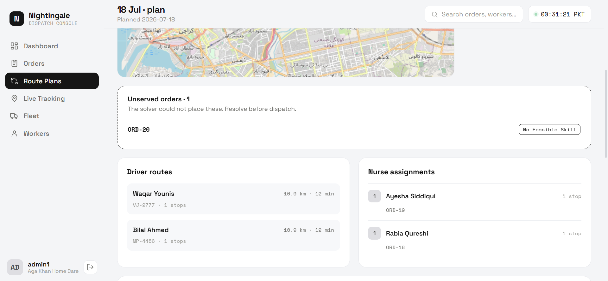
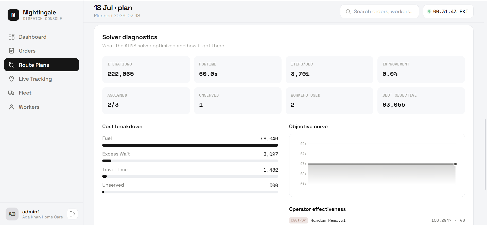
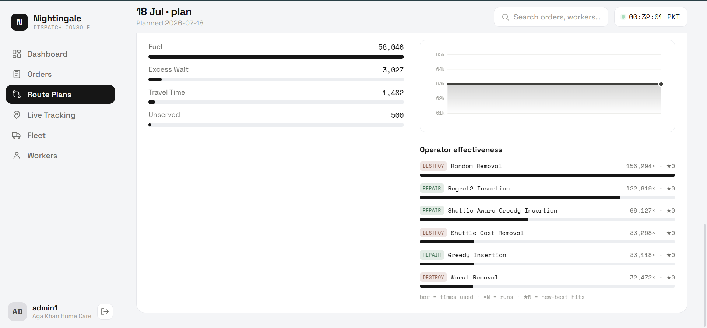
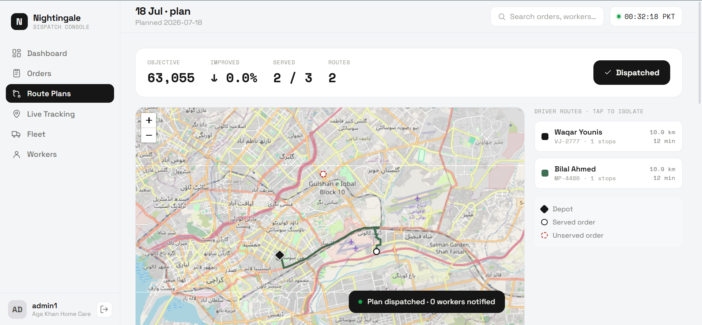

---

## 7. Flow E: Watch the Field Live (Tracking)

Once workers are out and have started their shifts on the mobile app, a dispatcher can watch
them move in real time.

```
 Live Tracking
   │
   ├─ map shows a dot per worker/vehicle currently reporting location
   ├─ click a dot / list entry ──► overlay card with that person's details
   └─ availability roster ──► who's available / unavailable, and why
```

1. Click **Live Tracking** in the sidebar.
2. The map shows a live-updating dot for every worker and vehicle currently sending GPS
   pings (this only happens once a worker has tapped **Start Shift** on their phone — see
   the mobile flow doc).
3. Dots that haven't updated in a while are visually flagged as **stale**, so a dispatcher
   can tell the difference between "just went quiet for a second" and "hasn't reported in
   a long time."
4. Click a dot or an entry in the side list to see that person's details in an overlay card.
5. Below the map, an **availability roster** shows every worker's current available/
   unavailable status — including the reason, if the worker provided one when they toggled
   themselves unavailable on the app.

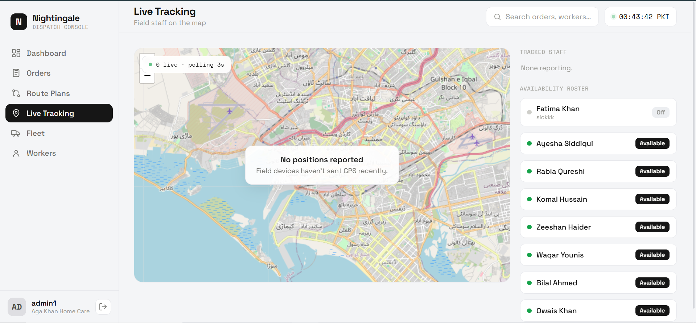
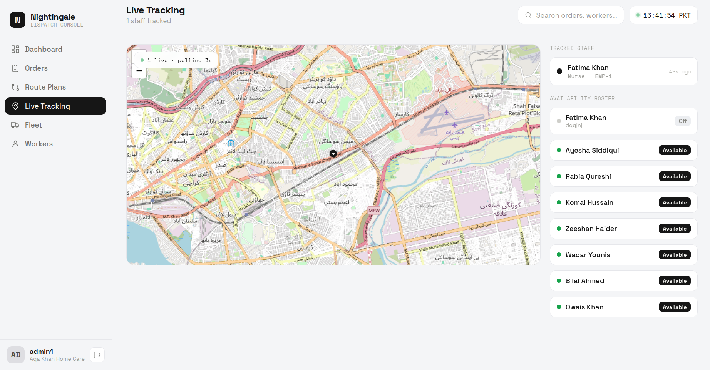
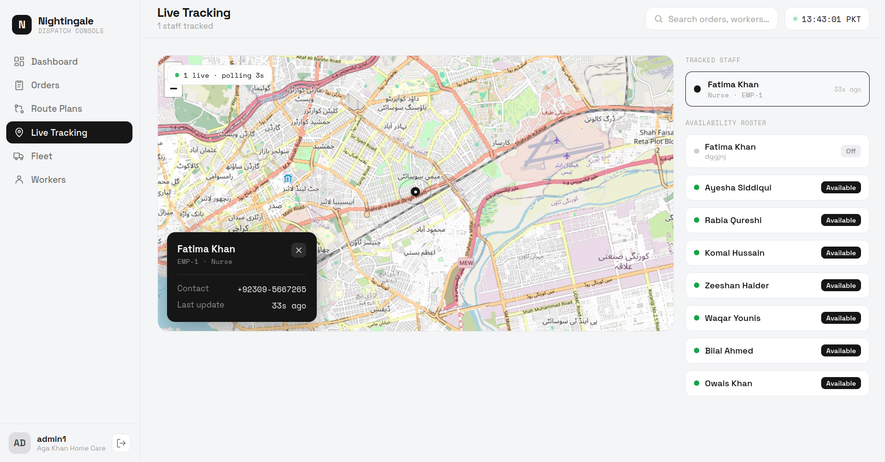
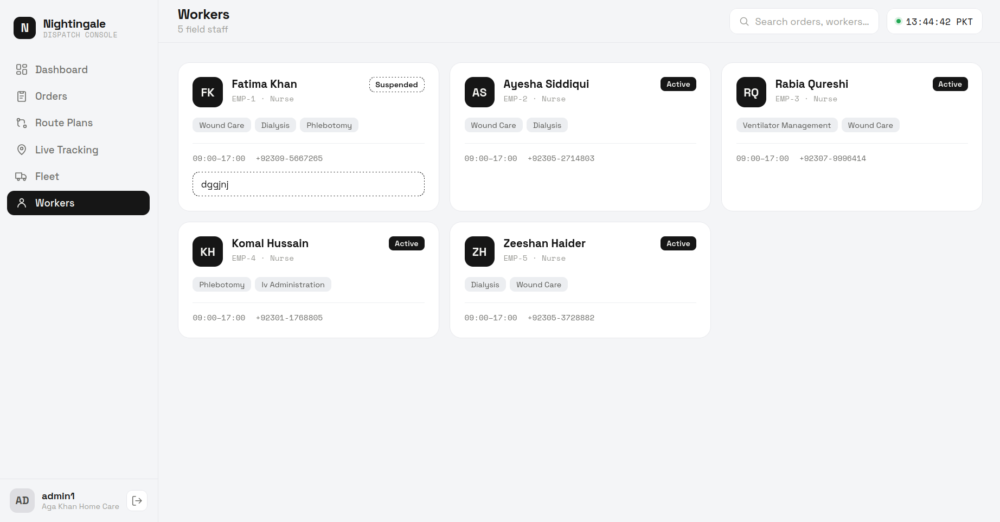
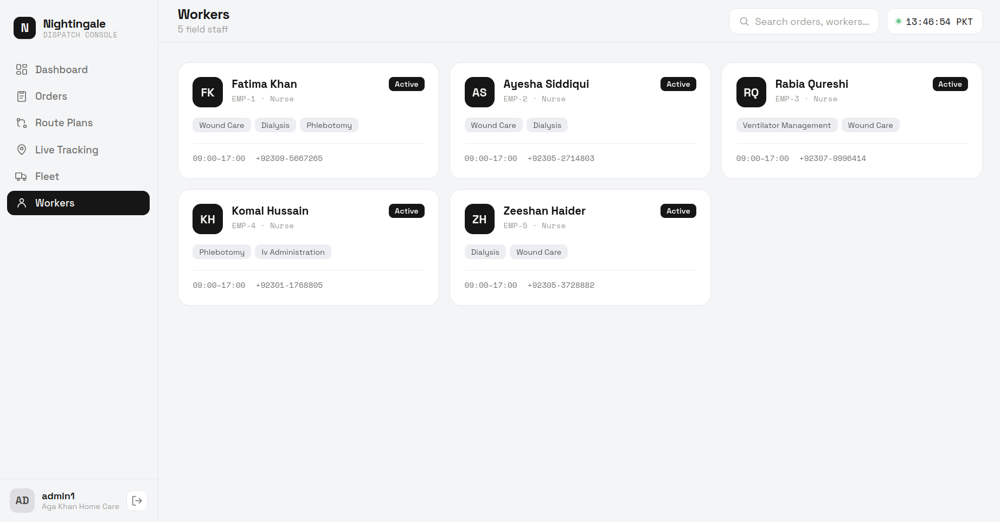

---

## 8. Flow F: Look Up Fleet or Worker Info

These two pages are reference-only — nothing is created or edited here, they're just for
looking things up.

```
 Fleet                                    Workers
   │  tabs: Vehicles / Drivers / Depots      │  card grid of nurses/technicians
   └─ click a tab to switch table            └─ shows skills, status, shift, contact
```

1. Click **Fleet** to see three tabbed tables: **Vehicles**, **Drivers**, and **Depots**.
   Switch tabs to see each list.
2. Click **Workers** to see a card grid of field staff, showing each person's skills,
   current status, shift hours, and contact info. A worker marked unavailable shows their
   reason right on the card.

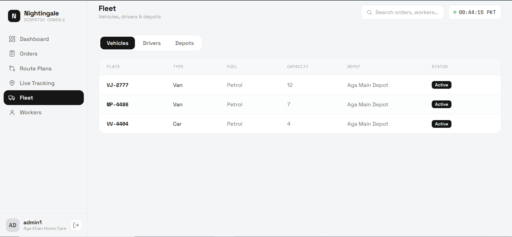
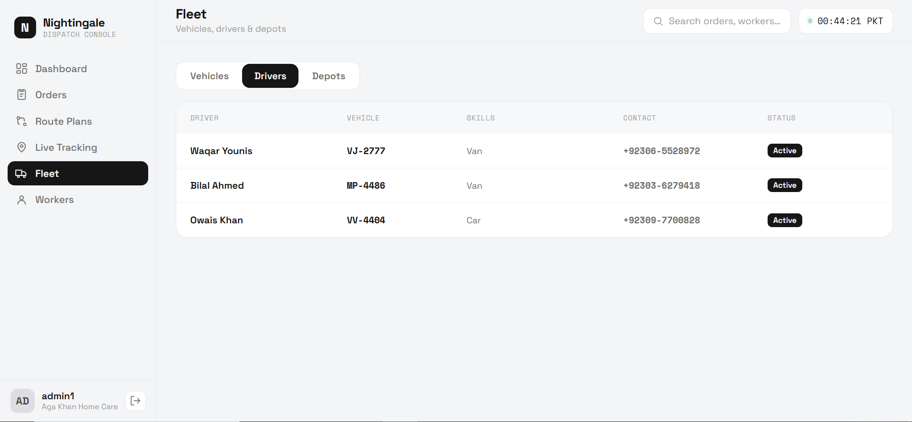
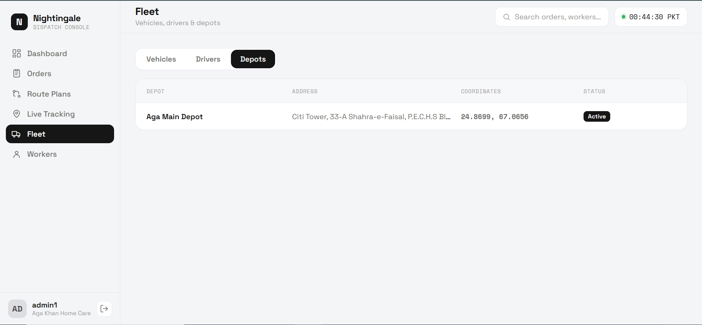
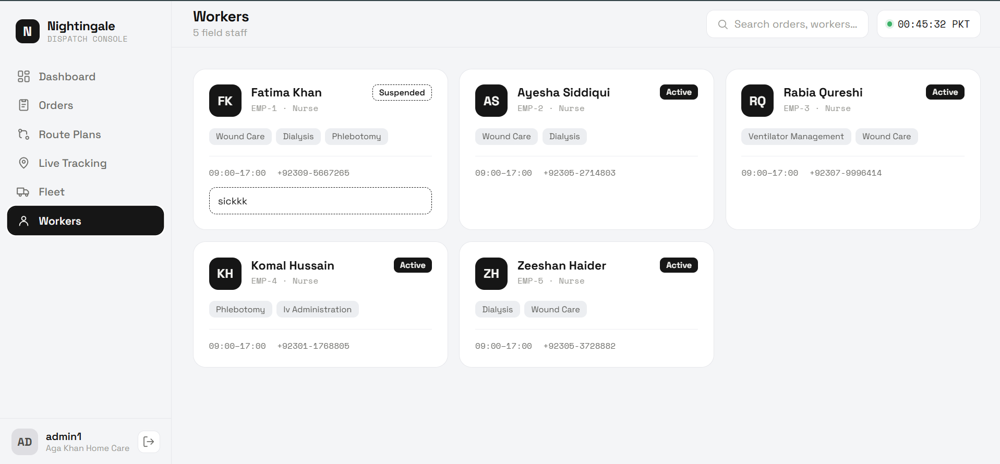

---

## 9. Putting It All Together (A Full Day)

A realistic end-to-end sequence, stitching every flow above into one day:

```
1. Sign in                                              (Flow A)
2. Check the Dashboard for an overview                  (Flow B)
3. Add any new orders that came in overnight             (Flow C)
4. Build today's route plan from the pending orders      (Flow D)
5. Review the optimized result, approve, dispatch         (Flow D)
6. Watch workers move on Live Tracking through the day    (Flow E)
7. Look up a vehicle or worker's details as questions come up  (Flow F)
```

---
